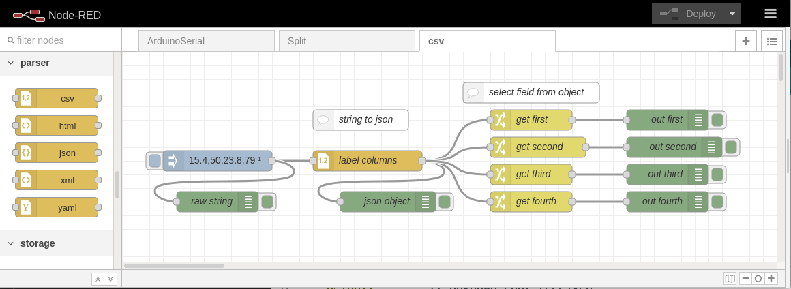

<!-- cSpell:enable -->
# csv node

<link href="css/my_css.css" rel="stylesheet"/>

Use «parser» csv node to convert a comma delimited string of values into a object with named fields. Use the names to then handle fields individually.

<!--
* [Link](#link_link)
## <a name="link_link">⚓</a> Link
-->

<!-- cSpell:disable -->
<!-- cSpell:enable -->
<!--
# cSpell:disable
# cSpell:enable
cSpell:words
cSpell:ignore
cSpell:enableCompoundWords
-->
