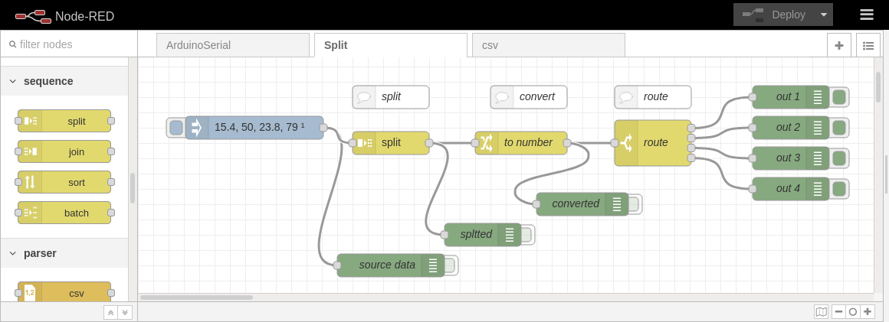

<!-- cSpell:enable -->
# split node

<link href="css/my_css.css" rel="stylesheet"/>

Use «sequence» split node to separate comma delimited values, and the generated sequence index number to handle them.

<!--
* [Link](#link_link)
## <a name="link_link">⚓</a> Link
-->

<!-- cSpell:disable -->
<!-- cSpell:enable -->
<!--
# cSpell:disable
# cSpell:enable
cSpell:words
cSpell:ignore
cSpell:enableCompoundWords
-->
